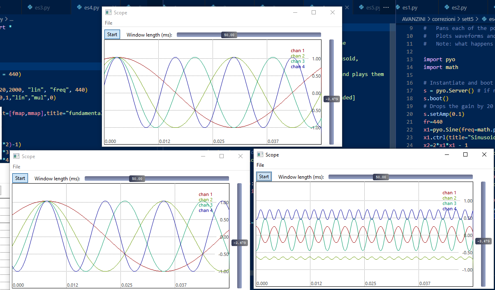

# IAS_project
Final project for IAS class 

Abstract:
This project is based on the extraction of features from audio 
data, their visualization and the training of kNN classifiers with such 
data.
Audio data has to be divided in training and testing sets, time and 
frequency domain features are extracted and the feature space is 
visualized. the kNN classifier is then trained on three groups of 
features and the optimal k is found. In the final stage the aim is 
optimization of the best performing classes.
Three classes of audio data where chosen. the classes are purposefully 
chosen with similar sounding sounds (Breathing, Sneezing and Snoring) and 
the recognition rate is expected not to be higher than 5% more than pure 
fortuity.
To approach this project i decided that i would only use the functions 
provided in the audioAnalysisLibrary so I had to make my own 
implementation of the windowize, extract_from_path, a function to extract 
all the audio features and one to train the kNN. I chose to do so to gain 
a deeper understanding of the matter and to not limit myself to a copy￾paste.
Results show that:
- number of coefficients which explain 80% of variance is 10 and the most 
significant ones are frequency domain features
-the best number for k is around 100 and works better with the third 
group (time and frequency together)
Introduction:
The extraction of features from audio data is a useful and 
powerfull tool for a lot of applications. It is a necessary step before 
any decision, interpretation or classification. These audio descriptors 
are low-level features and may not be meaningfull by themselves, 
manipulation and correlation is needed to make use of this short term 
data. Another advantage of feature extraction is the reduction of the volume of data. This is particularly usefull in real time systems, as 
audio streams can be very heavy.
Audio signals are divided in small blocks (frames) which can be 
overlapping and for each frame a set of features is computed. the result 
is a feature vector that can be used for analysis and processing 
purposes.
There are two main categories of audio features. Frequency and Time 
domain features.
Time domain features are calculated over time and are relevant to energy 
entropy and statistical aspects.
Energy, Energy Entropy and Zero Crossing Rate are computed and can be
particularly relevat in situation where temporal aspects are predominat 
rather than timbral/spectral.
Frequency domain features are based on the DFT of the audio signal and 
perform spectral analysis on the frames.
